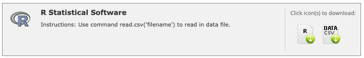

## How to tidy a dataset from REDCap which includes checkbox data

Using a simulated data set to emulate an export from REDCap, we will show a 
method of tidying checkbox data to make it more easy to work with in R.

## REDCap example

Here are some screenshots to show how checkbox data looks in REDCap and R.





In the example code that follows, using simulated data, we show how you can get 
the day name from the column label and store in a data frame in a tidy way. 

\newpage

## Setup

Load packages


```r
# Load required packages, installing as needed
if (!requireNamespace("pacman", quietly = TRUE)) install.packages("pacman")
pacman::p_load(tibble, dplyr, tidyr, stringr, knitr, ggplot2)
```

## Load data

Prepare simulated data set (similar to REDCap R data export format). If you 
have real data exported from REDCap for "R Statistical Software", that export 
would include an R script and a data file that you would use instead of the 
code in this section.


```r
# Set seed for reproducibility
set.seed(0)

# Define list of variables for activity checkbox column names and labels
act_cb <- 
  list(var = c("gym", "aerobics", "eat", "drink"), 
       label = c('Gym (Weight Training)', 'Aerobics', 
                 'Eat Out (Dinner/Lunch)', 'Drink (Alcoholic Beverages)'),
       num = as.character(0:4),
       choice = c('Monday', 'Tuesday', 'Wednesday', 'Thursday', 'Friday'))

# Create a vector of column names for a simulated dataframe
act_cb_vars <- unlist(outer(act_cb$var, act_cb$num, paste, sep = "___"))
column_names <- c("study_id", "sex", act_cb_vars)

# Create a row of simulated data
create_data <- function(x) {
  c(x, 
    sample(0:1, 1),
    sample(0:1, length(act_cb_vars), replace = TRUE))
}

# Create a dataframe with 10 rows of simulated data
df <- setNames(data.frame(t(sapply(1:10, create_data))), column_names)

# Create dataframes for checkbox column labels and choices
df_labels <- tibble(var = act_cb$var, val = act_cb$label)
df_choices <- data.frame(num = act_cb$num, choice = act_cb$choice)

# Join labels and choices dataframes
df_labels <- df_labels %>% cross_join(df_choices) %>% 
  mutate(var = paste0(var, '___', num), 
         label = paste0(val, ' (choice=', choice, ')')) %>% 
  select(var, label)

# Add factor variables to simulated dataframe
df <- df %>% 
  mutate(across(.cols = matches('^(?:eat|drink|gym|aerobics)'), 
                .fns = ~ factor(.x, 
                                levels = c("0", "1"), 
                                labels = c("Unchecked", "Checked")), 
                .names = "{.col}.factor")) %>%
  mutate(sex.factor = factor(sex, levels = c("0", "1"), 
                             labels = c("Female", "Male")))

# Set column labels
for (x in 1:nrow(df_labels)) {
  attr(df[[df_labels$var[x]]], "label") <- df_labels$label[x]
}

attr(df$study_id, "label") <- "Study ID"
attr(df$sex, "label") <- "Gender"
```

## Create tidy data set from simulated REDCap data

### Create choices data frame - Method #1


```r
# Create choices data frame (method #1) from three character vectors
create_choices <- function(var, label, num, choice) {
  cross_join(tibble(var, label), tibble(num)) %>% 
    left_join(tibble(num, choice), by = "num") %>% arrange(var, num)
}

act_cb_day1 <- 
  create_choices(
    var = c("gym", "aerobics", "eat", "drink"), 
    label = c('Gym (Weight Training)', 'Aerobics', 
              'Eat Out (Dinner/Lunch)', 'Drink (Alcoholic Beverages)'),
    num = as.character(0:4),
    choice = c('Monday', 'Tuesday', 'Wednesday', 'Thursday', 'Friday'))
```

### Create choices data frame - Method #2


```r
# Create choices data frame (method #2) from activity columns and labels
act_cb_day2 <- df %>% 
  filter(study_id == 1) %>%
  select(matches('^(?:eat|drink|gym|aerobics)___\\d+$')) %>% 
  mutate(across(everything(), ~ attr(.x, "label"))) %>% 
  pivot_longer(everything(), names_to = 'var', values_to = 'label') %>% 
  mutate(choice = str_replace(label, '^.*choice=(.*)\\)$', '\\1')) %>% 
  separate(var, into = c('var', 'num'), sep = '___') %>% 
  mutate(label = str_remove(label, ' \\(choice=.*$')) %>%
  select(var, label, num, choice) %>% arrange(var, num)
```

### Compare the two methods


```r
# Compare results from these two methods
all.equal(act_cb_day1, act_cb_day2)
```

```
## [1] TRUE
```

### Reshape


```r
# Define regular expression for activity factor columns
act_re <- '^(gym|aerobics|drink|eat)___(\\d+)\\.factor$'

# Get label for sex column to use for renaming sex.factor column
sex_lab <- sym(attr(df$sex, "label"))

# Reshape activity data
activity_data <- df %>% 
  select(study_id, matches(act_re)) %>% 
  pivot_longer(-study_id, names_pattern = act_re, names_to = c('var', 'num')) %>% 
  filter(value == 'Checked') %>% 
  left_join(act_cb_day1, by = c('var', 'num')) %>% 
  select(-value, -num) %>% 
  rename('activity' = var, 'activity_label' = label, 'day_name' = 'choice') %>% 
  left_join(df %>% select(study_id, !!sex_lab := sex.factor), by = "study_id")
```

## View table of results

We will limit the number of rows displayed to 14 for brevity.


```r
# View reshaped result (limit to first 14 rows for brevity)
activity_data %>% head(14) %>% kable()
```


| study_id|activity |activity_label              |day_name  |Gender |
|--------:|:--------|:---------------------------|:---------|:------|
|        1|aerobics |Aerobics                    |Monday    |Male   |
|        1|gym      |Gym (Weight Training)       |Tuesday   |Male   |
|        1|gym      |Gym (Weight Training)       |Wednesday |Male   |
|        1|aerobics |Aerobics                    |Wednesday |Male   |
|        1|drink    |Drink (Alcoholic Beverages) |Thursday  |Male   |
|        1|gym      |Gym (Weight Training)       |Friday    |Male   |
|        1|aerobics |Aerobics                    |Friday    |Male   |
|        1|eat      |Eat Out (Dinner/Lunch)      |Friday    |Male   |
|        2|aerobics |Aerobics                    |Tuesday   |Female |
|        2|gym      |Gym (Weight Training)       |Wednesday |Female |
|        2|aerobics |Aerobics                    |Wednesday |Female |
|        2|eat      |Eat Out (Dinner/Lunch)      |Wednesday |Female |
|        2|gym      |Gym (Weight Training)       |Thursday  |Female |
|        2|drink    |Drink (Alcoholic Beverages) |Thursday  |Female |

## View plot of results

This plot shows the benefits of restructuring the data into a tidy format.


```r
# Produce a plot to show benefits of reshaping into tidy data format
ggplot(activity_data, aes(day_name, fill = !!sex_lab)) + 
  geom_bar(stat = "count") + facet_wrap(~ activity_label, nrow = 2) + 
  scale_x_discrete(guide = guide_axis(angle = 45)) + 
  xlab("Day") + ylab("Count") + ggtitle("Activity Count by Day and Gender")
```

<!-- -->
