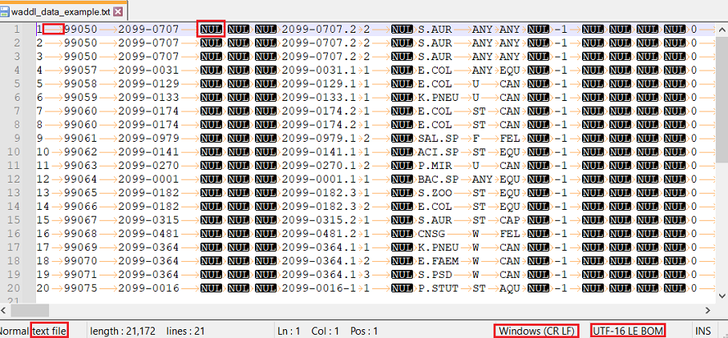
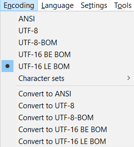
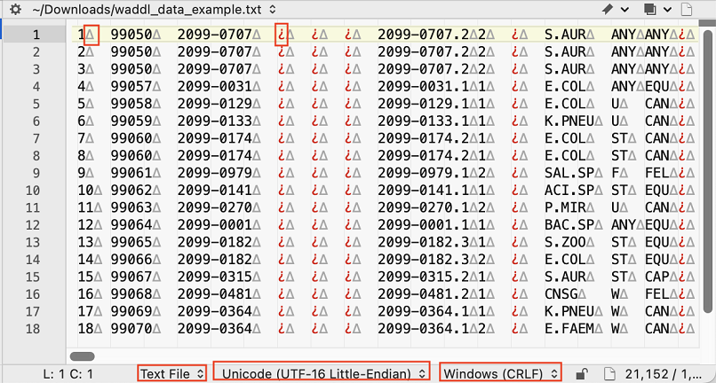
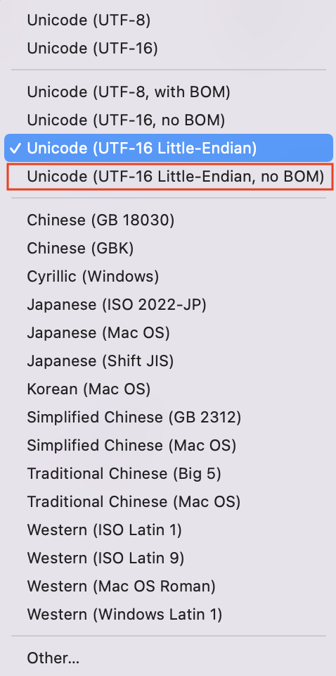

```{r knitr_setup, include=FALSE}
knitr::opts_chunk$set(tidy.opts = list(width.cutoff = 100), tidy = TRUE)
```

## Read WADDL file and convert to CSV

We will use an example "text" data file, a modified subset of a file we were told 
came from the [Washington Animal Disease Diagnostic Laboratory](https://waddl.vetmed.wsu.edu/) (WADDL). We were asked to read the file into R, but we were not told anything 
about the file format or structure, except that it was a "text" file.

This particular file format is challenging because the functions you would normally 
use for reading "text" files will not work without using some special options. 
Further, the data are not arranged in a familiar and [tidy](https://tidyr.tidyverse.org/articles/tidy-data.html) "columns are variables" structure.

We will explore how to address the issues that come up when reading this file: 

- Unexpected "embedded nulls" warning
- Unexpected "invalid multibyte string" error
- Unusual file encoding type
- Less common separator/delimiter
- Missing header (no column names)
- Columns with no values (which we will remove)
- Rows missing any useful data (which we will remove)
- Unusual data structure (not "tidy", as in not "columns are variables")

For the curious, we also provide more details in three appendices:

- Appendix I: What's an "embedded null"?
- Appendix II: What's UTF-16LE?

## Setup

First, we will load our R packages, set options, and set file paths.

```{r setup}
# Attach packages, installing as needed
if(!requireNamespace("pacman", quietly = TRUE)) install.packages("pacman")
pacman::p_load(formatR, knitr, dplyr, tidyr, stringi, stringr, purrr, readr)

# Set options
options(readr.show_col_types = FALSE, readr.show_progress = FALSE)

# Set file paths
txt_file <- file.path("data", "waddl_data_example.txt")
csv_file <- file.path("data", "waddl_data_example.csv")
```

## Data file inspection

The data file we were given had "Sensititre" in the name and ended with a ".TXT" 
suffix. An internet search revealed that [Sensititre](https://www.thermofisher.com/order/catalog/product/V3000-VZ) is a laboratory instrument 
used for antimicrobial sensitivity testing. We could not find a description of the 
file format and we were not provided with a code book to explain the variables. 
There is commercial software available for purchase that was designed to
work with this instrument called the Thermo Scientific™ Sensititre™ SWIN™ Software 
System. We do not have this software, nor could we find a manual for it available 
online.

The file can be opened in Notepad and [Notepad++](https://notepad-plus-plus.org/), 
but will not show much when opened in R's text editor. In Notepad++ we turned on 
View -> Show Symbol -> Show All Characters. We see it has no column headers, 
is tab delimited (shown as arrows), contains NUL characters, and the lines end 
with CR LF (carriage-return line-feed), the standard text file line ending 
characters used on Windows systems. 



In Notepad++, from the Encoding menu, we see "UTF-16 LE BOM". 



Opening the file on a Mac with [BBEdit](https://www.barebones.com/products/bbedit/), 
we selected View -> Text Display -> Show Invisibles. This shows the tabs as grey 
triangles and upside-down red question marks where there are no data values 
(empty fields). Maybe that is the symbol for NULs. At the bottom in the status 
bar, it says "Text File", "Unicode (UTF-16 Little-Endian)" and "Windows (CRLF)". 
So, that's the same file encoding as Notepad++ reported, but without the "BOM". 



If you select the file encoding shown in the status bar of BBEdit, you see that 
there is another choice for "Unicode (UTF-16 Little-Endian, no BOM)", so that 
implies the encoding of this file is "with BOM".



So, we expect we can read this file into R as "normal" text file, because of the 
file suffix and the identification of the file type in the text editors, 
but the NUL characters and atypical file encoding might need special treatment. 
Normally, we would expect a text file to not have any NUL characters and to be 
encoded as UTF-8, ANSI (Windows-1252 or CP-1252), ASCII, or Latin-1 
(ISO/IEC 8859-1). It's interesting that, when opened in R's text editor, the file 
does not show more than just the first character of the file ("1"). Maybe the 
encoding type or NUL characters are not supported by R's text editor.  

We could convert the file format in either Notepad++ or BBedit to UTF-8 (or convert 
with a shell utility like `iconv`) and make our lives a little easier, but we 
will try to do all processing in R for better automation and reproducibility.

## Embedded nulls

We will start with `read.table()`, specifying a tab delimiter and no header, 
and reading in just the first line. When we read it in we get some unexpected 
messages.

```{r embedded_nuls_and_multibyte_strings}
# Try reading with read.table, just the first row
try(read.table(txt_file, sep = "\t", header = FALSE, nrows = 1))
```

We get a warning "appears to contain embedded nulls". We saw NUL characters in 
Notepad++, and red upside-down question marks in BBEdit for empty fields, so 
perhaps that's what this is about. The warning will go away if we use `skipNul = TRUE`.

```{r skipnul}
# Try reading with read.table, just the first row
try(read.table(txt_file, sep = "\t", header = FALSE, nrows = 1, skipNul = TRUE))
```

However, we still see the "invalid multibyte string" error.

## Invalid multibyte strings

The "invalid multibyte string" error is a clue that the file is not encoded as 
expected (usually UTF-8, ANSI, or ASCII), so we check this with `guess_encoding()`.

```{r encoding}
# Check file encoding
readr::guess_encoding(txt_file, n_max = 1)
```

And the guesses are listed with the most likely encoding, "UTF-16LE", at the the 
top of the list with a probability of 1. Notepad++ showed the same encoding, 
but added "BOM". We can verify that encoding by checking the first four bytes 
of the file for the "byte order mark" (BOM). For UTF-16, we would expect a 
two-byte BOM, so checking the next two bytes after that will also let us see the 
first two-byte character of data.

```{r BOM}
# Look for a byte order mark (BOM) in the first four bytes to verify encoding
readBin(txt_file, what = "raw", n = 4)
```

This shows four pairs of symbols. Each pair represents the hexadecimal values 
for a byte (8 bits). With a 16-bit encoding, each character in the file is 
represented by 2 bytes. The first two bytes are `ff fe`, which is the "BOM" 
associated with UTF-16LE encoding. The next two bytes are `31 00`, which 
represents the character "1" in UTF-16LE. "1" is the first character of data 
in this file. These four bytes confirm UTF-16LE with BOM encoding for this file.

- See: https://www.unicode.org/faq/utf_bom.html#bom4
- And: https://en.wikipedia.org/wiki/Byte_order_mark#UTF-16

The BOM is the source of the "invalid multibyte string" error because `read.table()` 
does not know this file is encoded as UTF-16LE with BOM. 

When we set `fileEncoding = "UTF-16LE"`, reading the first line, there are no 
errors. We do not have to specify "BOM", and the BOM will be removed automatically.

```{r one_row}
read.table(txt_file, sep = "\t", header = FALSE, nrows = 1, skipNul = TRUE, 
           fileEncoding = "UTF-16LE") %>% as_tibble()
```

## Read the whole file

We get no errors when we try to read all of the rows.

```{r read_whole_file}
# Read file
df <- read.table(txt_file, sep = "\t", header = FALSE, skipNul = TRUE, 
                 fileEncoding = "UTF-16LE")
```

Yay! Let's take a look...

```{r view_data_1}
# View data
df[1:5, 1:50]
```

We see there are some blank fields in columns V23, V42, and columns after that. 
We would prefer to see NAs here. Let's see what's really in those empty fields.

```{r }
unique(df$V23)
unique(df$V42)
```

The blank fields are really the empty string (""). We will read the file again 
setting `na.strings = ""`.

```{r read_whole_file_again}
# Read file
df <- read.table(txt_file, sep = "\t", header = FALSE, skipNul = TRUE, 
                 fileEncoding = "UTF-16LE", na.strings = "")

# View data
df[1:5, 1:50]
```

So, now the blank fields have NA instead.

## Using `utils::read.delim()`

Alternatively, we can read the file with `read.delim()`. We can also omit 
`sep = "\t"` when using this function with this file.

```{r using_utils_read_delim}
# Read file
df1 <- read.delim(txt_file, header = FALSE, skipNul = TRUE, 
                  fileEncoding = "UTF-16LE", na.strings = "")

# Test to see if results are equal
all.equal(df, df1)
```

## Using `readr::read_tsv()`

We have been using classic "base R" functions from the built-in `utils` package 
to read the file. We can use the `readr` function `read_tsv()` instead. `readr` 
is one of the [core tidyverse packages](https://www.tidyverse.org/packages/). 
The "tsv" in the function name stands for [tab separated values](https://en.wikipedia.org/wiki/Tab-separated_values), so we don't 
need to specify the delimiter.

```{r, using_readr_read_tsv}
df2 <- read_tsv(txt_file, locale = locale(encoding = "UTF-16LE"), 
                col_names = FALSE, na = "")
```

The results, after some further processing, are identical:

```{r compare_results_with_readr_read_tsv}
df1 <- df %>% as_tibble() %>% 
  mutate(V41 = as.POSIXct(V41, tz = "UTC")) %>% 
  mutate(across(where(is.character), ~ str_trim(.x)))
df2 <- df2 %>% 
  set_names(str_replace_all(names(.), '^X', 'V')) %>% 
  mutate(across(where(is.character), ~ str_trim(.x)))
all.equal(df1, df2)
```

## Using `readr::read_delim()`

We can also try `read_delim()`, but we need to specify the delimiter, and we 
get some warnings. 

```{r using_readr_read_delim}
df2 <- read_delim(txt_file, locale = locale(encoding = "UTF-16LE"), 
                  col_names = FALSE, na = "", delim = "\t")
problems()
```

```
## # A tibble: 5,458 × 5
##      row   col expected           actual file                              
##    <int> <int> <chr>              <chr>  <chr>                             
##  1     1     4 1/0/T/F/TRUE/FALSE ""     /tmp/Rtmp76Hngx/file2d7533523b5ac3
##  2     1     5 1/0/T/F/TRUE/FALSE ""     /tmp/Rtmp76Hngx/file2d7533523b5ac3
##  3     1     6 1/0/T/F/TRUE/FALSE ""     /tmp/Rtmp76Hngx/file2d7533523b5ac3
##  4     1     9 1/0/T/F/TRUE/FALSE ""     /tmp/Rtmp76Hngx/file2d7533523b5ac3
##  5     1    13 1/0/T/F/TRUE/FALSE ""     /tmp/Rtmp76Hngx/file2d7533523b5ac3
##  6     1    15 1/0/T/F/TRUE/FALSE ""     /tmp/Rtmp76Hngx/file2d7533523b5ac3
##  7     1    16 1/0/T/F/TRUE/FALSE ""     /tmp/Rtmp76Hngx/file2d7533523b5ac3
##  8     1    17 1/0/T/F/TRUE/FALSE ""     /tmp/Rtmp76Hngx/file2d7533523b5ac3
##  9     1    18 1/0/T/F/TRUE/FALSE ""     /tmp/Rtmp76Hngx/file2d7533523b5ac3
## 10     1    21 1/0/T/F/TRUE/FALSE ""     /tmp/Rtmp76Hngx/file2d7533523b5ac3
## # … with 5,448 more rows
## # ℹ Use `print(n = ...)` to see more rows
```

We can ignore those warnings, since they just relate to the guessed 
column types and the NA value of "". If this function were to guess the 
column types *after* doing the NA conversion, the errors would be avoided, but 
the function does not seem to be smart enough to do that.

The results are the same, however, so we can silence the warnings.

```{r compare_results_with_readr_read_delim}
df2 <- read_delim(txt_file, locale = locale(encoding = "UTF-16LE"), 
                  col_names = FALSE, na = "", delim = "\t") %>% 
  suppressWarnings()

df2 <- df2 %>% 
  set_names(str_replace_all(names(.), '^X', 'V')) %>% 
  mutate(across(where(is.character), ~ str_trim(.x)))
all.equal(df1, df2)
```

Even so, that's still messier than simply using `read_tsv()` with this file. 

## Using `data.table::fread()`

We might also consider using `fread()` from the `data.table` package. 

```{r setup_data_table}
pacman::p_load(data.table)
```

`fread()` doesn't support UTF-16 encoding, so we need to modify the file 
encoding beforehand with an extra step. We can do this with `readLines()`. 

We also have to remove the BOM, so we'll do that with `str_remove()`. 

There are blank lines alternating with the data lines, and if we don't 
remove them, `fread()` will only read the first line. So, we'll use 
`blank.lines.skip = TRUE` to fix this.

First, we will define some helper functions:

```{r define_functions_read_lines_utf26le}
rm_bom <- function(x) sub('^(?:<[[:xdigit:]]{2}> ?)*', '', x)

rm_blank <- function(x) x[!grepl('^$', x)]

rl <- function(file, skipNul = TRUE, ...) {
  rm_blank(rm_bom(readLines(file, skipNul = skipNul, ...)))
}
```

Now we can use these functions with `fread()` to read the file. We'll make use of 
`readr::guess_encoding()` to show how generalizable this approach can be.

```{r using_data_table_fread}
enc <- readr::guess_encoding(txt_file, n_max = 1)[1, ]$encoding
df3 <- rl(txt_file, encoding = enc) %>% 
  fread(text = ., sep = "\t", header = FALSE, na.strings = "")

df1a <- df %>% as.data.frame() %>% 
  mutate(V41 = as.POSIXct(V41, tz = "UTC")) %>% 
  mutate(across(where(is.character), ~ str_trim(.x)))
df3a <- df3 %>% as.data.frame() %>%
  mutate(V41 = as.POSIXct(V41, tz = "UTC")) %>% 
  set_names(str_replace_all(names(.), '^X', 'V')) %>% 
  mutate(across(where(is.character), ~ str_trim(.x)))
all.equal(df1a, df3a)
```

If we have the [iconv](https://en.wikipedia.org/wiki/Iconv) shell utility 
installed, we can use the `cmd` argument to perform the encoding conversion as 
`fread()` reads the file.

```{r using_data_table_fread_cmd, eval = FALSE}
df4 <- fread(cmd = paste("iconv -f UTF-16LE -t UTF-8", txt_file), sep = "\t", 
             header = FALSE, na.strings = "")
all.equal(df3, df4)
```

```
## [1] TRUE
```

We get identical results with either of these `fread()` approaches.

It would be nicer to use R's `iconv()` function instead of the shell utility, 
but the `iconv()` function does not support dropping embedded nulls.

As with `read_delim()`, these two `fread` variations are messier than the earlier 
alternatives, and so it would be difficult to justify using `fread` for this file.

## Using `vroom::vroom()`

The final alternative we will try is `vroom()`. 

```{r setup_vroom}
pacman::p_load(vroom)
```

We can use the same arguments as for `read_tsv()`, but we can omit the `na` 
argument. We will add `show_col_types = FALSE` to silence the chatter.

```{r, compare_results_using_vroom_vroom}
df5 <- vroom(txt_file, locale = locale(encoding = "UTF-16LE"), 
            col_names = FALSE, show_col_types = FALSE)

df5 <- df5 %>% 
  set_names(str_replace_all(names(.), '^X', 'V')) %>% 
  mutate(across(where(is.character), ~ str_trim(.x)))
all.equal(df1, df5)
```

We are calling `vroom()` with so few arguments, it's interesting that it still 
gives equivalent results.

`vroom()` is [supposed to be faster](https://vroom.r-lib.org/) than any of the 
previous alternatives we have tried. And it's straightforward to use. So, that's 
probably the best choice, at least for larger files.

## Auto-detecting file encoding

If all we did to investigate the file before running any R was to open it in 
Notepad, and if we only saw that the file appeared to be whitespace delimited and 
lacked a header line, then we could have used a more generic `vroom()` approach. 

That is, if we test for encoding first, then we can read this file without knowing 
anything about its encoding, embedded nulls, or tab delimiter.

```{r generic_approach_with_vroom}
# Define a function to create a locale using a guessed file encoding
guess_locale <- function(file, n_max = 10000, threshold = 0.2, ...) {
  # Parameters file, n_max, and threshold are passed to readr::guess_encoding(). 
  # Parameters ... are passed to readr::locale(). 
  
  require(stringi, quietly = TRUE)
  require(readr, quietly = TRUE)
  
  file_encoding <- 
    readr::guess_encoding(file, n_max = n_max, threshold = threshold)[1, ]$encoding
  
  valid_encodings <- stringi::stri_enc_list(simplify = TRUE)
  
  if (file_encoding %in% valid_encodings) {
    file_locale <- readr::locale(encoding = file_encoding, ...)
  } else {
    file_locale <- readr::locale(...) 
  }
  
  return(file_locale)
}

# Guess encoding and specify Timezone as America/Los_Angeles
file_tz <- "America/Los_Angeles"
file_locale <- guess_locale(txt_file, n_max = 1, tz = file_tz)

# Read file
df5 <- vroom(txt_file, locale = file_locale, col_names = FALSE, show_col_types = FALSE)

# Check results
df1 <- df %>% as_tibble() %>% 
  mutate(V41 = as.POSIXct(V41, tz = file_tz)) %>% 
  mutate(across(where(is.character), ~ str_trim(.x)))
df5 <- df5 %>% 
  set_names(str_replace_all(names(.), '^X', 'V')) %>% 
  mutate(across(where(is.character), ~ str_trim(.x)))
all.equal(df1, df5)
```

In other words, if we just made `vroom()` a little smarter, smart enough to guess 
the encoding by itself, then we could ignore the encoding issue entirely. 

The locale also contains other default values (like Timezone) which may not be 
appropriate for our file, so we would still want to be careful with those aspects.

## Check dimensions

Okay, after exploring various ways to read the file, let's move on to cleaning 
up the data. First, we'll check the dimensions to get an idea of the side of the 
dataset.

```{r check_dim}
# Read file
df <- read.table(txt_file, sep = "\t", header = FALSE, skipNul = TRUE, 
                 fileEncoding = "UTF-16LE", na.strings = "")

# Check dimensions
dim(df)
```

That's a lot of columns! Maybe more than we need...

# Remove columns with no data

When we looked at the lines, we saw lots of empty values, so let's try to 
remove columns that contain no data, as they are just taking up space.

```{r initial_cleanup}
# Remove columns containing only NA values
df <- df %>% select(where(~ sum(is.na(.x)) < length(.x)))

# Check dimensions
dim(df)

# View data
df[1:5, 1:20]
```

195 columns have been removed.

## Remove rows with no drug data

By inspection, we see that column V42 is the first column with an abbreviated 
antimicrobal drug name ([AMIKAC](https://www.ncbi.nlm.nih.gov/books/NBK430908/)) in it.

```{r, find_drug_start_col_name}
drug_start_colname <- names(df)[unlist(map(df, ~ "AMIKAC" %in% unique(.)))]
drug_start_colname
```

By inspection, it appears there are sets of three columns for each drug name 
from this column onward. But some rows have no data in these columns. We will 
remove those rows, as we don't need them.

Let's find the index of this first drug column to help us with filtering.

```{r find_drug_start_col_index}
# Find the numerical index of column V42 to use for filtering
drug_start <- grep(drug_start_colname, names(df))
drug_start
```

Now we can filter out those rows with only NAs in the drug columns.

```{r filter_rows}
# Remove rows containing no drug data, e.g., where columns V42 onward are all NA
df <- df %>% filter(!if_all(all_of(drug_start:ncol(df)), ~ is.na(.)))
```

Now let's check the dataframe dimensions again to see if there are fewer rows.

```{r check_dim_after_filtering}
# Check dimensions
dim(df)
```

We see that 2 rows have been removed.

## Examine structure of drug data

When we look at the columns of drug data, we see a strange structure.

```{r examine_data_structure}
# View data
df %>% select(V42:V50) %>% head()
```

By inspection, we see columns containing drug data are in sets of 3:
drug_name drug_quantity drug_qualifier, example: "AMIKAC" " <= 16" "NOINTP".

## Reshape drug columns

We would prefer a structure where there were two colums per drug: one for the 
quantity and the other for the qualifier, which we will call "RIS". We want 
the two colums to be named after the drug, which is contained in the first 
of the three columns for each set. So, we will extract these first.

```{r rename_columns}
# Identify columns containing only a single abbreviated drug name (or NA)
drug_cols <- names(df)[drug_start:ncol(df)][drug_start:ncol(df) %% 3 == 0]
col_vals <- map(drug_cols, ~ table(df[, .x])) %>% setNames(drug_cols)

# Confirm all of these variables only contain 1 value matching name pattern
table(unlist(map(col_vals, length)))
table(unlist(map(col_vals, ~ grepl('^[A-Z]+$', names(.x)[1]))))

# Extract the drug names and column number
drugs <- sapply(col_vals, names)
drug_nums <- as.numeric(gsub('^V', '', drug_cols))

# Rename drug columns in sets of 3 columns for each drug: name, value, and RIS
drugs_df <- tibble(drug = drugs, drug_num = drug_nums) %>%
  mutate(col1_old = paste0('V', drug_nums),
         col2_old = paste0('V', drug_nums + 1),
         col3_old = paste0('V', drug_nums + 2)) %>%
  mutate(col1_new = paste0(drug, '_NAME'), 
         col2_new = paste0(drug, '_VAL'),
         col3_new = paste0(drug, '_RIS'))
lookup <- with(drugs_df, 
               c(col1_old, col2_old, col3_old) %>%
      setNames(c(col1_new, col2_new, col3_new)))
df <- rename(df, any_of(lookup))
```

## Final cleanup

Now, all we need to do is remove extra spaces from the value columns, abbreviate 
the names of the drug value columns, and remove the original drug name columns. 
We won't worry about providing column names for the non-drug columns right now.

```{r final_cleanup}
# Clean up data
df <- df %>% 
  mutate(across(ends_with('_VAL'), 
                ~ str_trim(str_replace_all(.x, '\\s+', ' ')))) %>%
  rename_with(~ str_remove(., '_VAL')) %>%
  select(-ends_with('_NAME'))

# View results
df[1:5, 15:20]
```

After saving the results to a CSV file, we are done.

```{r save_results}
# Save result as CSV
write_csv(df, csv_file)
```

## Appendix I: What's an "embedded null"?

A "null" ([NUL](https://en.wikipedia.org/wiki/Null_character)) is a non-printing
character that is used in some languages to terminate a character string. In 
modern character sets a NUL is encoded as 0. You can see them using `readBin()`. 
This will show the [hexadecimal](https://en.wikipedia.org/wiki/Hexadecimal) 
equivalents of the characters. The nulls are the 00 values.

```{r see_nulls}
x <- readBin(txt_file, what = "raw", n = 18)
x
```

And we can "decode" the hexadecimal characters with `rawToChar()`, if we remove
the nulls first and then remove the hexadecimal bytes with `gsub()`:

```{r decode}
rm_bom <- function(x) sub('^(?:<[[:xdigit:]]{2}> ?)*', '', x)
paste(rawToChar(x[x!=0], multiple = TRUE), collapse = " ") %>% rm_bom()
```

In doing so, we are treating each byte (8 bits) as a character and we are 
skipping the nulls (and "BOM"). But some files are encoded such that a character 
is two or more bytes, such as UTF-16LE. 

For example, if we assume each character is 2 bytes (16 bits), and we assume 
that the first byte is the "most significant" (aka, "little endian"), like 
UTF-16LE, then we get the same result with:

```{r two_byte_little_endian_8_chars}
y <- readBin(txt_file, what = "character", n = 8, size = 2, endian = "little")
paste(y, collapse = " ") %>% rm_bom()
```

Here we decoded the first 8 characters of our UTF-16LE file the hard way.

But what about an "embedded null"?

```{r one_bytes_46_chars}
x <- readBin(txt_file, what = "raw", n = 46)
x
```

Where we see `00 00` that is an "embedded null" since it is a two-byte NULL and
our file has 16 bit encoding. Let's decode it as if it had 8-bit characters.

```{r one_bytes_46_chars_decoded}
paste(rawToChar(x[x!=0], multiple = TRUE), collapse = " ") %>% rm_bom()
```

Now let's decode it as having 16-bit characters.

```{r two_byte_little_endian_24_chars}
y <- readBin(txt_file, what = "character", n = 24, size = 2, endian = "little")
paste(gsub('^$', 'NUL', y), collapse = " ") %>% rm_bom()
```

We substituted the empty string ("") for `NUL` so these would be visible, 
since the NULs were decoded as "". Each two-byte NUL was actually `0000000000000000` 
(16 zeros) in the file, but we are showing them as `NUL NUL`.

It turns out we actually need to "skip" the embedded nulls (`\x00\x00`), or we 
will just read a few values.

```{r one_row_with_warnings_suppressed}
read.table(txt_file, nrows = 1, fileEncoding = "UTF-16LE") %>% suppressWarnings()
```

The reason is that we actually do have real embedded nulls and these need to be 
properly handled. Sometimes the file reading stops when a null is encountered, 
as in the example above. Or you may be able to read any data at all:

```{r read_lines_wth_nothing_read}
read_lines(txt_file, locale = locale(encoding = "UTF-16LE"))
```

These nulls may be intended as `NA` values for this file format. Since we don't 
have a code book or file format description, we can't be sure, but if the tab 
is actually the delimiter, then this is how the empty "cells" are presented in 
this file. So, maybe we can try setting the null as a NA value:

```{r null_as_na, eval=FALSE}
try(read.table(txt_file, nrows = 1, fileEncoding = "UTF-16LE", na.strings = "\x00"))
```

```
Error: nul character not allowed (line 1)
```

Unfortunately we are not allowed to enter nulls here. So, we have to skip them. 

```{r null_as_na_num_cols}
df_one_row <- read.delim(txt_file, nrows = 1, fileEncoding = "UTF-16LE", skipNul = TRUE)
num_na_cols <- map(df_one_row, ~ sum(is.na(.))) %>% unlist() %>% sum()
num_na_cols
```

Of the `r ncol(df_one_row)` columns read in, `r num_na_cols` columns contained an NA.

Unfortunately, some of the file reading functions do not support skipping 
nulls and just give warnings, errors or no results when it encounters these 
values. In those cases, where the function simply cannot handle embedded nulls, 
you can either use a function that does, or remove the nulls beforehand.

```{r read_with_readLines_before_fread}
rm_bom <- function(x) sub('^(?:<[[:xdigit:]]{2}> ?)*', '', x)

rm_blank <- function(x) x[!grepl('^$', x)]

rl <- function(file, skipNul = TRUE, ...) {
  rm_blank(rm_bom(readLines(file, skipNul = skipNul, ...)))
}

enc <- readr::guess_encoding(txt_file, n_max = 1)[1, ]$encoding
dt <- rl(txt_file, encoding = enc) %>% 
  fread(text = ., sep = "\t", header = FALSE, na.strings = "")
dim(dt)
```

At least now we have a better idea of what embedded nulls are, why 
they're there (probably), and why it's (probably) okay to skip them, at least in 
this situation.

## Appendix II: What's UTF-16LE?

UTF-16 is a file encoding for 16-bit (2-byte) Unicode characters. We suspected we 
had an UTF-16LE file because of the two special bytes starting the file. These 
particular bytes, `FF FE` specify that the encoding is "little endian" (LE), 
giving us UTF-16LE encoding. 

- See: https://en.wikipedia.org/wiki/Endianness
- And: https://www.tutorialspoint.com/big-endian-and-little-endian

If we had a UTF-32LE file, it would have started with `FF FE 00 00`. If the file 
was UTF-8, it would either not have a BOM or the BOM would be `EF BB BF`. 

Because UTF-8 is represented with single bytes, there is no big or little "end". 
[Endianness](https://en.wikipedia.org/wiki/Endianness) is to specify byte order, 
so you need more than one byte per character to have a byte order. The 
difference between "LE" and "BE" are just the order of the two bytes in each 
multibyte character. We can see the difference with an example that compares the 
bytes of LE and BE representing the character "1":

```{r le_vs_be}
x <- "1"
Encoding(x) <- "UTF-8"
x8 <- charToRaw(x)
x16LE <- iconv(x, "UTF-8", "UTF-16LE", toRaw = TRUE)
x16BE <- iconv(x, "UTF-8", "UTF-16BE", toRaw = TRUE)
kable(t(c(x = x, 'UTF-8' = x8, 'UTF-16LE' = x16LE, 'UTF-16BE' = x16BE)))
```

Those `00` values look like the dreaded "embedded nulls", right? But now we see 
those are valid after all. They are simply one of the two bytes of some UTF-16 
characters. That's why the warning said, *appears* to contain embedded nulls. 

Unfortunately, some file reading functions do not support UTF-16LE encoding. To 
use those functions with UTF-16LE files, you have to convert the format 
beforehand, as we did in Appendix I with `readLines()` before using `fread()`.

